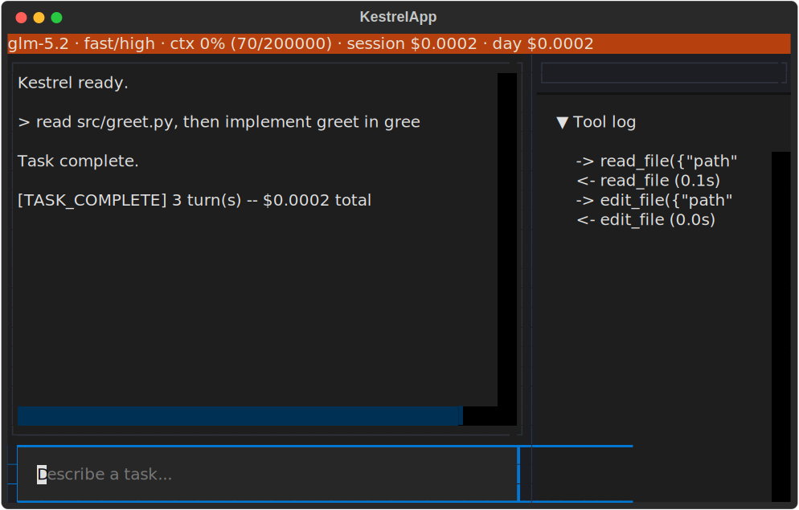
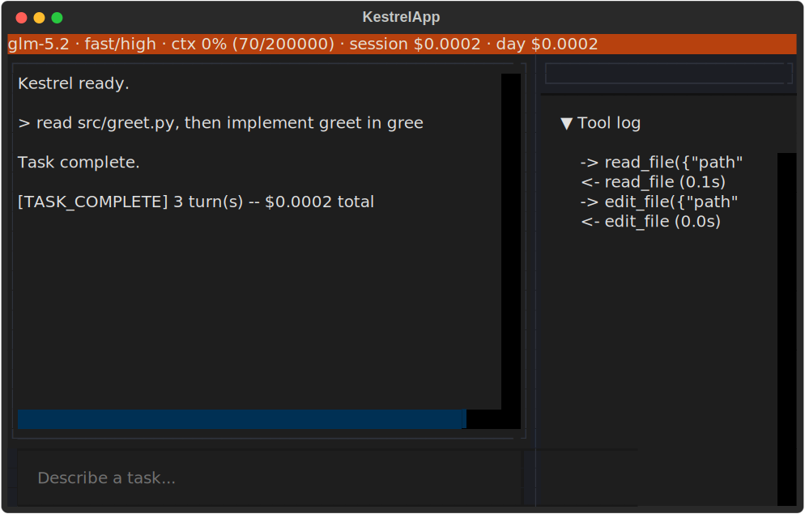
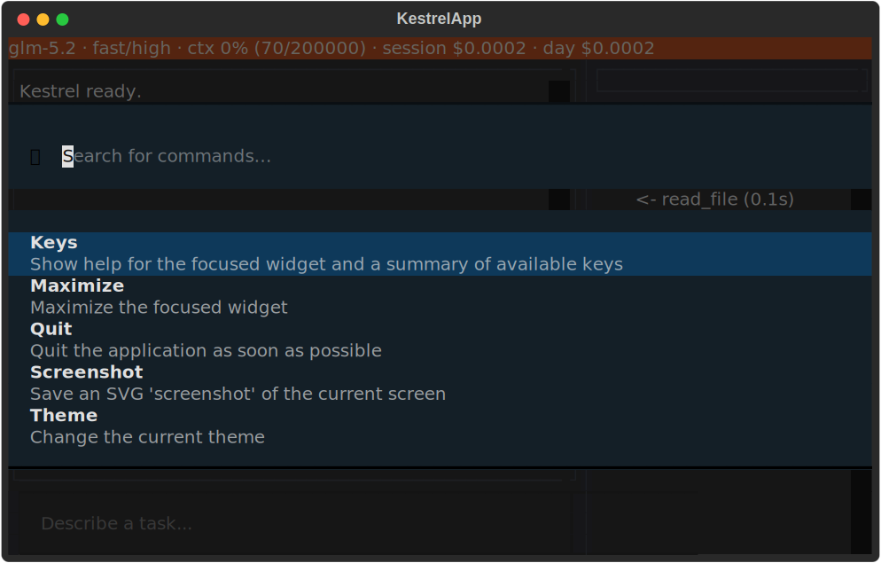

# kestrel

<p align="center">
  
</p>

## Install (dev)

```sh
git clone https://github.com/aruneem-bhowmick/kestrel.git
cd kestrel
uv sync
uv run pytest -m "not live and not e2e"
```

## Configuration

Kestrel reads settings from `kestrel.toml`. On startup it checks, in
order, an explicit `--config` path, `$KESTREL_CONFIG`, `./kestrel.toml`,
and a per-user config directory, stopping at the first one it finds; if
none exist it falls back to built-in defaults. Files are never merged
across these layers. See `src/kestrel/data/kestrel.default.toml` for every
recognized key and its default value. Secrets (API keys, tokens,
passwords) must never be placed in this file -- set them as environment
variables instead.

### Router policy

`[router.policy]` maps each of five task classes -- `plan`, `execute`,
`critique`, `trivial`, and `embed` -- to a registry `Tag`
(`"planner"`, `"executor"`, `"cheap"`, or `"local"`) it should route
to. Defaults: `plan` -> `"planner"`, `execute` -> `"executor"`,
`critique` -> `"cheap"`, `trivial` -> `"cheap"`, `embed` -> `"local"`.
`kestrel.router.policy.resolve_model_id` turns a task class into a
real model id by picking the first registry entry (sorted by id) that
carries the mapped tag, falling back to a caller-supplied default id
when no entry does. `"critique"` is its first live consumer -- see
"Agent loop" below for how the self-critique phase routes through it.

## Project memory

Kestrel reads an optional `KESTREL.md` from the target repo's own root
-- free-form notes and conventions written by that repo's maintainers,
in the same per-repo-memory tradition as `CLAUDE.md`. Unlike
`kestrel.toml`/`models.toml`, it has exactly one location and no search
precedence: a repo either has one or it doesn't, and having none is a
normal outcome, not an error. Because it's authored by the repo's own
maintainers rather than fetched at runtime by a tool, its text is
trusted project memory -- it is never run through the untrusted-content
framing every `read_file`/`search`/`execute` result goes through.

A `KESTREL.md` may also carry one fenced ` ```kestrel-verify ` block: a
small TOML table naming up to three commands the repo wants to be checked,
any of which may be omitted:

```kestrel-verify
lint = "ruff check ."
build = "true"
test = "pytest -q"
```

The `verify` tool (see [Tools](#tools)) runs whichever of these are
configured and reports pass/fail back to the model.

## Models

Available models live in `models.toml`, an array of `[[models]]` tables
each naming a Kestrel-stable id, backend, provider-side model name, and
USD-per-million-token rates. On startup Kestrel checks, in order, an
explicit registry path passed to `load_registry()`, `./models.toml`, and
a per-user config directory, stopping at the first one it finds; if none
exist it falls back to the registry bundled with the package
(`src/kestrel/data/models.default.toml`), which ships two full-size
GLM-5.2 routes (OpenRouter and Z.ai direct) plus a smaller, `"cheap"`-
tagged OpenRouter route for the agent loop's own budget degradation to
fall back to. Files are never merged across these layers.
Every entry is validated at load time; misconfigured entries fail with a
message naming the file, the entry, and the field at fault.

## Provider layer

Every backend adapter implements one interface,
`kestrel.provider.ProviderClient.complete()`, and streams a normalized
event sequence rather than its own wire format: zero or more
`TextDelta`/`ToolCallEvent` events, then exactly one `UsageEvent`, then
exactly one `StopEvent` as the final event --
`kestrel.provider.validate_stream_order()` checks a sequence against this
grammar. On failure, a call raises a typed `ProviderError` subclass
(`AuthError`, `RateLimitError`, `ContextOverflowError`, `ServerError`)
naming the active model id and backend, instead of emitting a stop event.
No call site outside an adapter names a vendor.

`kestrel.provider.LiteLLMClient` is the first concrete adapter: it routes
any registry entry with `backend = "openrouter"` through LiteLLM's
OpenAI-compatible streaming interface, normalizing OpenRouter's chunks and
errors into that same grammar and taxonomy. It reads its API key from the
entry's `api_key_env`, never from a config file, and fails with `AuthError`
before making any network call if that variable is unset or empty.
Integration tests redirect it to a local mock server via the
`KESTREL_OPENROUTER_BASE_URL` environment variable instead of the real
OpenRouter endpoint; this variable is inert unless set and has no effect
outside test runs. A registry entry with `backend = "zai"` routes through
the same client's OpenAI-compatible path against the entry's own
`endpoint` directly -- no environment-variable redirection, since the
registry itself already names where to call.

`effort` is mapped onto each backend's own native reasoning-depth knob by
`LiteLLMClient`'s internal `_effort_kwargs()`, a second per-backend switch
next to the one that resolves routing: OpenRouter calls carry a
`reasoning.effort` field translated from Kestrel's own `Effort` scale,
Z.ai calls carry `thinking.effort` as a direct pass-through. A future
backend adds its own case to that same function.

`kestrel.provider.complete_with_retry()` wraps any `ProviderClient.complete()`
call with bounded exponential backoff and full jitter, retrying only
`RateLimitError` and `ServerError` -- never `AuthError` or
`ContextOverflowError`, since neither improves on a later attempt with the
same inputs -- and only when the failure occurs before any event has
reached the caller, so a partially-consumed stream is never replayed.
A `RateLimitError` carrying an explicit `retry_after_s` is honored
verbatim in place of the computed delay. `RetryPolicy` controls the
attempt count and backoff bounds; retrying across multiple models or
backends is out of scope for this wrapper.

Both the agent loop and the REPL send the exact same leading messages,
byte-for-byte, on every turn of one task or session:
`kestrel.provider.cache.build_stable_prefix()` renders one system-role
message from the fixed system prompt, folding in the target repo's
`KESTREL.md` (loaded once, up front, and never reloaded mid-task) when
one exists. Sending an identical prefix turn over turn is what lets a
cache-capable backend actually reuse its cached compute instead of
reprocessing the whole thing from scratch on every call.
`mark_cache_breakpoints()` sits next to it as a dormant extension point:
no backend wired up today needs an explicit marker for where that
prefix ends, so it is currently a no-op, but a future adapter for a
backend that does need one can read `Message.cache_breakpoint` off the
last message this function annotates. Whether an entry needs that marker
is `ModelEntry.requires_explicit_cache_breakpoint`, a plain per-entry
flag rather than a hardcoded backend name -- onboarding a backend that
needs one is a registry change, not a code change.

## Tools

Kestrel offers a model a small, fixed set of capabilities -- read,
search, edit, execute, and verify -- rather than an open-ended plugin
surface.
Every tool declares its own `ToolSchema` and returns its result already
wrapped by `kestrel.security.frame_untrusted`, so a model never has to
guess whether a byte it receives back is data or an instruction.
`kestrel.tools.registry` is where all of them are wired together:
`all_schemas()` collects every tool's schema for a provider call's own
`tools=` argument, and `dispatch()` routes one returned tool call to
its bound parser and executor, framing an unknown tool name, a
malformed argument payload, or a caught tool error into an ordinary
result rather than letting any of them crash the calling loop. Adding a
tool means adding it to that module's own registration list -- nothing
else needs to change.

- **`read_file`** -- reads a UTF-8 text file, or a 1-indexed inclusive
  line range within it, from a repo-relative path. Refuses a path that
  escapes the repository root (including by following a symlink out of
  it), a missing file, a directory, and binary content; a whole-file read
  with no line range given is capped at 64 KiB, truncated with a note
  naming how much was cut.
- **`search`** -- runs a regex pattern against file contents under the
  repo (or a repo-relative subdirectory scope) via `rg`, and returns
  matched lines in deterministic file order, capped at a caller-supplied
  result count. Requires `rg` (ripgrep) on `PATH`; refuses a scope that
  escapes the repository root and a pattern `rg` rejects as invalid
  regex. A search that matches nothing is a normal result, not an error.
- **`execute`** -- runs a command (an argv list, never a shell string)
  in a `bwrap` sandbox scoped to the repo: the rest of the filesystem is
  mounted read-only, the repo and a fresh scratch directory are
  read-write, and the network namespace is unshared, so the command
  always runs with networking disabled. Returns the command's stdout,
  stderr, and exit code;
  a command that runs past its timeout is reported back as timed out
  rather than left to hang. Requires `bwrap` (bubblewrap) on `PATH`. A
  command recognized as `delete`, `chmod`, or a force-flagged
  `git push` is gated behind interactive approval before it runs (see
  [Approval](#approval)).
- **`edit_file`** -- replaces one exact, unique occurrence of an anchor
  string in a UTF-8 text file with new text. An anchor that is absent,
  or that occurs more than once, is refused rather than guessed at, and
  the file is left untouched either way. Every real edit is written to
  disk and then recorded to the undo journal (see [State](#state))
  before the call returns; passing `dry_run: true` instead returns a
  unified diff of the change without writing anything or touching the
  journal. Does not create new files -- an anchor checked against a
  path with no file on disk is refused the same way a missing anchor
  is, never treated as a request to create that file.
- **`verify`** -- runs whichever of the repo's own configured
  lint/build/test commands (see [Project memory](#project-memory)) apply,
  in that fixed order, through the same sandbox `execute` uses. Every
  configured command always runs to completion, even after an earlier
  one fails, so every check's own result comes back together. Returns a
  short pass/fail summary per command -- never a command's own
  stdout/stderr -- and separately renders and persists the full
  per-command output as markdown to
  `.kestrel/artifacts/verification-<task_id>-<turn_id>.md` (a numeric
  suffix is appended if that name is already taken, so calling `verify`
  more than once in the same task and turn never overwrites an earlier
  report). Pass `only` (an array of `"lint"`/`"build"`/`"test"`) to
  restrict a call to a
  subset of what's configured. Refuses to run when the repo has no
  KESTREL.md, or when nothing it configures matches what was asked for.
  Reloads KESTREL.md fresh on every call, since a prior turn's
  `edit_file` may have just changed it.

More tools land here as they're implemented.

## State

Kestrel writes its own runtime state under `<target-repo>/.kestrel/`: an
append-only undo journal (`kestrel.managers.UndoManager`), under
`.kestrel/artifacts/`, persisted verification reports from the `verify`
tool, and under `.kestrel/sessions/`, one append-only JSONL journal per
task (`kestrel.managers.SessionManager`) recording every turn's message
deltas, priced cost, and latest verification report. Target repos should
gitignore that path.

## Approval

`kestrel.managers.ApprovalManager` gates five kinds of destructive
action -- `delete`, `force_push`, `chmod`, `network_on`, and
`out_of_repo_write` -- behind interactive approval. The last two are
recognized but dormant this release: `execute`'s sandbox always runs
with networking disabled, and `edit_file` refuses an out-of-repo write
outright rather than offering it as an approvable escalation, so
neither has a live call path into the manager yet. `execute` is the
first live caller, classifying its command against a small pattern
table (`rm`/`rmdir`, `chmod`, and a force-flagged `git push`) and
calling `ApprovalManager.check()` for any match before the command
reaches the sandbox; a command outside that table runs unchecked.

Every check is either short-circuited -- the action's kind is in the
per-repo allowlist, or was already approved `"always"` earlier in the
session -- or handed to a decision function, which defaults to a plain
terminal prompt printing the action's summary and exact detail, then
reading one reply: `y`/`yes` approves just that one request (`"once"`),
`always` approves it and every later request of the same kind for the
rest of the session, and anything else -- including an empty reply --
denies it, raising `ApprovalDenied`.

Pre-approve specific kinds for an entire session via
`[managers.approval] allowlist` in `kestrel.toml`:

```toml
[managers.approval]
allowlist = ["delete"]
```

The TUI cockpit (see below) never uses the plain terminal prompt: it
supplies its own decision function, `kestrel.tui.approval_modal.
make_tui_decide_fn`, which renders a real `ApprovalModal` screen naming
the same summary and exact detail the terminal prompt would have
printed, with `y`/`a`/`n` key bindings or button clicks standing in for
the plain-text reply. The tool call proposing the action runs on a
background thread, not the app's own event loop, so the decision
function bridges the two with `asyncio.run_coroutine_threadsafe`: it
schedules the modal onto the app's event loop and blocks the calling
thread until the modal is dismissed with a real decision, rather than
crashing or hanging trying to open Textual UI from the wrong thread.

## Cost

Every completed turn is priced from the active model's own registry rates
using `kestrel.cost.compute_turn_cost`, which turns a `UsageEvent`'s
input/output/cached token counts into a `Decimal` USD amount (six decimal
places, `ROUND_HALF_EVEN`). `kestrel.cost.CostMeter` accumulates these
across a session, and `kestrel.cost.format_cost_line` renders the exact
line printed after each turn: input and output token counts, the turn's
own cost, and the running session total, each rounded to four decimal
places for display. A cache-hit count is only shown when nonzero, and a
turn with no usage at all still prints `$0.0000` rather than nothing --
a missing cost is meant to be noticed, not hidden.

`CostMeter.cache_hit_ratio` divides the session's total cached input
tokens by its total input tokens, entirely in `Decimal` arithmetic, and
returns `None` before any turn with real usage has been recorded.
`CostMeter.cache_alert` turns that ratio into a one-line warning naming
the measured percentage, but only once a session is long enough and the
active model is cache-capable: the active model's `supports_cache` must
be `True`, at least three turns must have been recorded, and the ratio
itself must sit below 50%. A cache-incapable model or a session with
only one or two turns never warns -- a short session never had a prior
turn's prefix to hit against, and a backend without cache support was
never expected to hit at all. The REPL's `/cost` command prints this
warning, when present, after the per-turn table.

## Budget

`kestrel.managers.BudgetManager` classifies how much has been spent
against three independently configurable USD caps -- session, day, and
month -- returning whether each is under budget (`OK`), past a soft
warn/degrade threshold (`SOFT`), or past its hard halt threshold
(`HARD`). It is a pure classifier: it never reads a file or tracks
spend itself, only turns three already-computed `Decimal` totals
(session/day/month spend, however a caller chooses to compute them)
into a `BudgetEvent` naming the worst status across all three and,
when more than one cap ties at that status, the first one in
session/day/month priority order.

A cap of `None` never trips, regardless of spend. Any configured cap
trips `HARD` once spend reaches it, and `SOFT` once spend reaches
`cap * soft_threshold` (0.8 by default, i.e. 80% of the cap). Configure
caps and the soft-threshold fraction per repo via `[managers.budget]`
in `kestrel.toml`:

```toml
[managers.budget]
session_usd = 5.00
day_usd = 20.00
month_usd = 100.00
soft_threshold = 0.8
```

Any of the three caps may be left unset for "no cap" on that scope.

Setting `LoopDeps.budget` wires this classifier into the agent loop
itself -- see "Agent loop" below for how a `SOFT` or `HARD` result
actually changes a running task.

## Agent loop

`kestrel.agent.run_task` drives one task to completion through a
tool-calling loop, distinct from the plain-chat REPL: each turn calls
the model with whichever tool set `LoopDeps.available_tools` selects
(every registered tool by default), sanity-checks what it proposes via
an injectable self-critique function, dispatches every requested tool
call through `kestrel.tools.registry.dispatch` (turning a denied
approval into a framed refusal instead of raising), and folds the
turn's usage into a running total. A turn that requests no tools at
all is the task's natural completion.

Every collaborator a task needs -- the provider client, the model
registry, the approval and undo managers, the cost meter, and the
task's own limits -- arrives through one `LoopDeps` bundle rather than
global state. `LoopLimits` bounds a task with three hard caps (turn
count, cumulative tokens, wall-clock time); crossing any of them ends
the task with the matching `TerminationReason` rather than running
unbounded, and a `KeyboardInterrupt` mid-task ends it the same way,
keeping whatever turns and cost had already accumulated. A
`ContextOverflowError` raised while streaming a turn also ends the
task outright -- see "Compaction" below for how context-window
pressure is recovered from before that ever happens, and why it can
still happen despite that.

Not yet implemented: a policy deciding which effort level or tool set a
given task should actually run with (see below for the fields
themselves), artifact persistence, and subagents.

Self-critique makes a real, routed model call by default:
`kestrel.agent.critique.make_self_critique_fn` sends one short,
non-streamed completion asking whether a turn's proposed action looks
reasonable, parsed down to a single `APPROVE`/`REJECT` word (failing
open -- approving -- on an empty, garbled, or otherwise unparseable
reply). `kestrel.task_setup.build_task_deps` wires this in for every
caller, routing the `"critique"` task class through
`kestrel.router.policy.resolve_model_id` against `[router.policy]`'s own
`critique` tag (`"cheap"` by default). Set `[managers.self_critique]
enabled = false` to skip it entirely and fall back to `agent.loop`'s own
always-approve default instead -- the exact behavior every caller had
before this flag existed. A critique call goes through the same
provider client a task's own turns do, so it is billed by the backend
like any other request rather than a free, simulated side channel --
but it is deliberately not folded into the task's own `CostMeter` total
or session journal, since `LoopDeps.self_critique_fn`'s call site passes
it only a turn's proposal and history, nothing else.

Whether the model's own say-so is enough to end a task is configurable
via `LoopDeps.require_verification` (default `False`, preserving the
behavior above unchanged). Set it `True` and a turn that requests no
tools only completes the task once the most recent report in
`LoopDeps.verification_reports` -- filled in as the `verify` tool runs
during the task -- actually passed; otherwise the loop folds a nudge to
call `verify` into history and keeps going, the same shape the
self-critique-skip path already uses. This never adds a new way for a
task to end: an unbounded task still stops only via the turn, token, or
wall-clock cap, exactly as it always could.

`LoopDeps.effort` (default `"high"`) and `LoopDeps.available_tools`
(default `None`, meaning every registered tool) are per-task fields
rather than fixed constants: `effort` is sent on every turn in place of
the single hardcoded level every call used before this field existed,
and `available_tools` narrows the schema list a turn is offered via
`kestrel.tools.registry.schemas_for` and gates a requested call against
that same set -- a call naming a tool outside it is refused with a
framed result folded into history as an ordinary tool-role message,
never dispatched and never fatal to the loop. Leaving both fields at
their defaults behaves exactly as every caller did before either field
existed; nothing here decides which effort or tool set a task should
actually run with, it only carries whichever values a caller supplies.

Setting `LoopDeps.session` to a `kestrel.managers.SessionManager` makes
a task resumable: every real turn is journaled as it completes, and
`kestrel.agent.resume_task(task_id, deps)` reconstructs a prior task's
history, cost meter, and last verification report from that journal and
continues driving it -- picking the turn-cap counter up from where the
journal left off, while sampling wall-clock budget fresh rather than
inheriting elapsed time from before the process restarted. A task run
without `session` set behaves exactly as before and cannot later be
resumed. `resume_task` also takes an optional `inject_message`: when
set, it is folded into the loaded history as one new user-role message
before the resumed drive begins, letting a caller steer a task with new
instructions -- and letting a task that already reached `TASK_COMPLETE`
be resumed at all, not only one a cap or crash halted mid-run. Leaving
`inject_message` unset preserves the exact resume behavior every
existing caller already relies on.

Setting `LoopDeps.budget` to a `kestrel.managers.BudgetManager` makes a
task check its own spend every turn: `spent_day_usd`/`spent_month_usd`
are fixed baselines the caller computes once, up front, before the task
starts, and the loop adds its own growing `meter.session_usd` on top of
them for each check. Crossing the soft threshold switches every
following turn to whichever registry entry is tagged `"cheap"` (the
packaged default registry now ships one), printing a warning either
way -- there is no TUI yet to show it in -- and a task degrades at most
once, to at most one cheaper entry, never cascading through further
tiers and never reverting to a costlier one even if spend later looks
fine. Crossing the hard threshold ends the task immediately with
`TerminationReason.BUDGET_HALT`; because every turn up to and including
the one that tripped it was already journaled (when `session` is also
set), `resume_task` picks it back up once an operator raises the cap.
Leaving `budget` unset (the default) skips every check above and
behaves exactly as it did before this field existed.

Setting `LoopDeps.observer` to a `kestrel.agent.observer.LoopObserver`
makes a running task's own progress externally observable, live,
rather than only inspectable once it ends: seven hooks fire as the
task runs -- a turn starting, each streamed text chunk, a tool call
starting and finishing, a fresh `VerificationReport` landing, a turn's
own priced cost settling, and the task's own termination. Every call
happens synchronously, inline, on the same coroutine driving the task,
so an observer must stay fast and exception-free -- nothing it returns
is ever read, and nothing it does can change what the loop decides
next. Leaving `observer` unset (the default) wires in an all-no-op
`NullLoopObserver` and behaves exactly as it did before this field
existed.

### Compaction

Context-window pressure is recovered from, not just detected. Once a
turn's own billed prompt size (`deps.meter.turns[-1].input_tokens`)
reaches 70% of the active model's `context_window`, the next
iteration's pre-check folds everything in `history` but the most
recent few messages into one model-generated summary via
`kestrel.agent.compaction.compact_history`, before spending another
real model call. That call is explicitly instructed to preserve the
task's own goal, any plan or TODO language the conversation already
contains, and the most recent verification outcome, rather than
inventing new steps of its own -- the folded-away messages are
replaced by a single `"system"`-role message holding that summary.

The summarization call itself is priced, journaled (when
`LoopDeps.session` is set), and checked against `LoopDeps.budget` (when
set) exactly like any other turn -- sharing its own journal record's
turn id with the real turn that immediately follows it, and never
incrementing `LoopResult.turns_used`, which counts only real model
calls -- and it can itself end the task outright (a hard budget halt or
the cumulative token cap) before that following turn's own model call
is ever made. This reduces how often a task ends `CONTEXT_OVERFLOW`,
not the possibility of it: a single message that alone exceeds the
window still ends the task that way, compaction or not. Neither the
70% threshold nor how many trailing messages are kept verbatim is
configurable via `kestrel.toml` yet -- both are fixed constants.

## Running a task

`kestrel run "<task>" --repo PATH` drives the agent loop against a real
repository from the command line, non-interactively:

```sh
kestrel run "add a function + unit test, make it pass" --repo /path/to/repo
```

It resolves config, registry, starting model, and the target repo's own
`KESTREL.md` exactly like the plain REPL does (the same
`--config`/`--model` flags, in either position around the subcommand),
builds a fresh `ApprovalManager`, `UndoManager`, `SessionManager`, and
`CostMeter` for this run alone, and calls `run_task` to completion.
`--max-turns`, `--max-total-tokens`, and `--max-wall-clock-s` override
`LoopLimits`'s own defaults. A destructive tool call still prompts on
the real terminal exactly as described under [Approval](#approval); a
piped, non-interactive answer works identically to a typed one.

`--require-verification`/`--no-require-verification`
(default: **enabled**) sets `LoopDeps.require_verification` -- with it
on, a task only completes once the most recent `verify` call passed
(see [Agent loop](#agent-loop)); pass `--no-require-verification` for a
task whose repo has no configured `verify` commands, or that should
still complete on the model's own say-so as it did before this flag
existed.

`--mode {plan,fast}` (default: **fast**) selects which mode the run
itself executes under -- see [PLAN mode](#plan-mode) below.

`--session-budget-usd`, `--day-budget-usd`, `--month-budget-usd`, and
`--budget-soft-threshold` build the run's own `BudgetManager` (see
[Budget](#budget)), each falling back to `kestrel.toml`'s own
`[managers.budget]` table when left unset; day and month spend baselines
are computed once, up front, from every other task's own journaled
history under this repo. Because every run now also builds a
`SessionManager`, a task that halts `BUDGET_HALT` can always be picked
back up with `kestrel run --resume TASK_ID --repo PATH` instead of the
usual `kestrel run "<task>" --repo PATH` invocation -- same flags
otherwise, continuing the halted task's own history, cost, and turn
count rather than starting over.

When it finishes, `kestrel run` prints a terse summary -- the task id
(needed to undo this run later), the termination reason, the turn
count, the total priced cost, a cache-hit line once at least one turn
has recorded real usage, and every distinct path the run's own undo
journal recorded a mutation for -- then exits `0` if the task reached
`TASK_COMPLETE` and `1` for every other termination reason:

```text
task_id: 3b1e7b7a-...
reason: TASK_COMPLETE
turns: 3
total_usd: $0.0071
cache_hit: 62%
files changed:
  src/greet.py
```

A `BUDGET_HALT` termination prints an abbreviated summary instead --
still the task id and reason line, but the turn count, cost, cache-hit,
and files-changed lines are replaced by a dedicated message naming which
cap tripped and the exact command to resume:

```text
task_id: 3b1e7b7a-...
reason: BUDGET_HALT
budget halt: session cap reached; resume with: kestrel run --resume 3b1e7b7a-... --repo /path/to/repo
```

`kestrel undo --task-id ID --repo PATH` reverts every file mutation a
prior run recorded under that id, restoring each touched path to its
exact pre-task content and printing what it reverted. Reverting twice
in a row is safe (see [State](#state)): the second call targets the
first's own compensating journal entry and simply toggles the file back.

### PLAN mode

`--mode plan` runs the task read-only: `build_task_deps` narrows
`LoopDeps.available_tools` to `read_file`/`search` only, raises
`effort` to `"max"`, and forces `require_verification` off regardless
of `--require-verification`'s own setting -- a PLAN-mode task is never
offered `verify`, so requiring it would nudge the task forever. A tool
call outside that pair is refused before it ever dispatches, exactly
like any other tool-access restriction (see [Agent loop](#agent-loop)),
so a confused model that still tries to edit a file leaves it
untouched and simply gets nudged back toward a plain-text reply on its
next turn.

Once the task ends (on anything other than `BUDGET_HALT`), its final
reply is parsed into an `ImplementationPlan`, written under
`.kestrel/artifacts/plan-<task_id>.md`, and named in a `plan:` line
printed in place of the ordinary `files changed:` summary:

```text
task_id: 3b1e7b7a-...
reason: TASK_COMPLETE
turns: 2
total_usd: $0.0034
plan: /path/to/repo/.kestrel/artifacts/plan-3b1e7b7a-....md
```

A reply the parser cannot make sense of (an empty final message, or a
task that ended mid tool-call) exits `1` with the parse failure printed
to stderr instead of a plan. This CLI path is a one-shot, non-interactive
plan-then-exit flow -- reviewing a plan with line comments and asking for
a revision is the TUI cockpit's own iterative flow, not something
`kestrel run --mode plan` offers on its own.

`--resume` re-reads `--mode` from its own invocation's flags rather than
remembering what the original `run` was started with, so resuming a
PLAN-mode task also needs `--mode plan` repeated -- omitting it falls
back to the ordinary summary instead of a re-parsed plan.

## TUI

Running `kestrel` with no subcommand mounts a Textual-based cockpit
instead of the plain REPL: a conversation pane streaming the active
task's assistant text, an artifact viewer for the task's most recently
produced artifact, a collapsible tool log of tool calls and their
outcomes, a diff view for the most recent file mutation, and a one-line
status bar docked to the top of the screen. A 2fr-wide left column
holds the conversation pane above a task-input box; a 1fr-wide right
column stacks the artifact, tool-log, and diff panes.

`F1`-`F4` jump focus to the task-input box, the tool log, the diff
pane, and the artifact pane in turn; `ctrl+q` quits. The artifact pane
shows the task's most recent `VerificationReport`, rendered as Markdown
with `kestrel.tools.verify.render_verification_markdown` and sanitized
before display, or -- for a task submitted while the cockpit's own mode
is `"plan"` -- the `ImplementationPlan` its final reply parsed into,
rendered the same way with `kestrel.agent.plan.render_plan_markdown`
via `ArtifactPane.show_plan`; it shows static placeholder content until
either one produces its first artifact.

With a plan on screen, `c` opens `kestrel.tui.plan_comment_modal
.PlanCommentModal`: a small dialog asking for a plan-line number and a
free-text comment, dismissing into a queued `kestrel.agent.plan
.PlanComment` once both are valid. Resubmitting the task-input box
while at least one comment is queued -- whatever text (if any) it
happens to carry -- drives `kestrel.agent.plan.revise_plan` against the
same underlying task instead of starting a brand new one; the model's
own revised reply replaces the artifact pane's plan, and the queued
comments are cleared once it lands. A plan's own `PLAN-mode` scoping
(restricted tools, `"max"` effort, no verification requirement) applies
identically to a revision turn, since it runs through the same
`_prepare_task_run` path a fresh submission does. There is no screen
for editing or removing an already-queued comment short of submitting
or restarting the cockpit; opening the modal again is how a second
comment is added to the same pending batch.

A typical PLAN-mode session, start to finish, looks like: propose a
task while mode is `"plan"` and review the resulting plan in the
artifact pane; comment on any line and resubmit to revise it, as many
rounds as needed; once it looks right, switch mode to `"fast"`
(`/mode fast` or `ctrl+p`); then submit again -- blank input is fine,
and means "proceed as planned" -- to execute it. That final submission
does not start a new task: it continues the plan's own conversation,
with every tool now available and effort restored to FAST's own level,
so the model acts from the exact history that produced the plan rather
than a fresh, contextless restatement of it. `_plan_task_id` and
`_last_plan` are cleared once execution ends, so the cockpit's next
submission after that behaves as an ordinary new task.

Submitting text in the task-input box always runs a full task through
`run_task` -- the same tool-calling agent loop `kestrel run` drives --
never a plain chat turn: the conversation pane renders the assistant's
own text incrementally at newline boundaries as it arrives, the status
bar refreshes after every turn, and the run ends with a terse one-line
summary naming the termination reason, turn count, and total cost.
`kestrel.repl`'s own `run_turn`/`ReplSession`/`run_repl` remain in the
codebase, unchanged and still exercised by their own test suite --
`kestrel` itself no longer wires any subcommand to `run_repl` directly,
but the streaming and terminal-sanitization logic it implements is
exactly what the cockpit (and the rest of `kestrel.tui.*`) builds on.

The status bar renders one line from a `StatusSnapshot` value --
active model, mode and effort, context-window usage, and session/day
spend against their caps:

```text
{model_id} · {mode}/{effort} · ctx {pct}% ({used}/{window}) · session ${session_usd:.4f}{cap} · day ${day_usd:.4f}{cap}
```

`ctx` renders as `--% (--/{window})` before any turn has billed. Each
`{cap}` segment renders ` / cap $X.XXXX` when that scope's budget cap
is configured, and is omitted entirely (a bare `$X.XXXX`) when it
isn't -- the same "`None` means no cap" convention the cost meter and
budget manager use throughout. `StatusBar.show(snapshot)` is the
widget's own hook onto this rendering; a fresh `KestrelApp` shows an
idle snapshot on mount, and `TuiLoopObserver` (see below) keeps it
current for the rest of a submitted task's own run.

Every submitted task builds its own collaborators -- provider client,
approval gate, undo journal, cost meter, session journal, and budget
manager -- through `kestrel.task_setup.build_task_deps`, the same
function `kestrel run` itself now delegates to. Extracting that
construction out from under the CLI's own `argparse.Namespace` means
the cockpit and the CLI build an identical bundle from one shared
place, rather than two copies that could quietly drift apart from each
other over time.

`kestrel.tui.observer_bridge.TuiLoopObserver` is the bridge between a
running task and the cockpit's own widgets: it is handed to
`build_task_deps` as that task's observer, and its hooks fire
synchronously, inline, on the same coroutine driving the task, so
calling widget methods directly from inside them is safe. A turn
starting or finishing refreshes the status bar; each streamed chunk of
assistant text is sanitized and appended to the conversation pane's own
currently streaming line; a tool call starting or finishing writes a
line to the tool log and toggles the loading indicator; an `edit_file`
call that actually mutated a file renders that mutation in the diff
pane; a `verify` tool call's own `VerificationReport` renders in the
artifact pane; and the task's own termination writes a terse summary
line. A PLAN-mode task's own completion is handled separately, outside
the observer: `KestrelApp._show_plan_from_result` parses and persists
the finished task's plan and renders it in the artifact pane itself,
since a PLAN-mode task -- read-only, restricted to `read_file`/`search`
-- never calls `verify` and so never reaches `TuiLoopObserver.
on_verification` at all.

Every tool call a running task makes writes two lines to the
collapsible tool log: `-> {name}({summary})` when it starts, where
`summary` is the call's own (sanitized) JSON arguments capped at 120
characters with a trailing `...` when longer, and `<- {name}
({elapsed_s:.1f}s)` once it finishes. A small loading indicator, docked
directly under the status bar, is visible for as long as at least one
tool call is in flight and hidden the rest of the time. Whenever an
`edit_file` call actually changes a file, the diff pane re-renders to
show that mutation as a syntax-highlighted unified diff, built from the
undo journal's own before/after content for the change -- there is no
history to browse back through; only the single most recent mutation
is ever shown, and a fresh one simply replaces whatever the pane showed
before.

Pressing `ctrl+p` opens Textual's own command palette, populated by
`kestrel.tui.commands.KestrelCommandProvider` with one entry per named
command, fuzzy-matched against whatever is typed:

- `/model <id>` -- switch the active model to `<id>`, one entry per
  model in the loaded registry.
- `/mode plan` / `/plan` and `/mode fast` / `/fast` -- switch the
  active PLAN/FAST mode (either spelling works).
- `/undo` -- revert the most recently *finished* task's own journaled
  mutations; warns instead if no task has finished yet this session.
- `/cost` -- print the most recently run task's session total and a
  per-turn cost breakdown to the conversation pane.
- `/resume <task_id>` -- resume a prior task, one entry per session
  journal found under `.kestrel/sessions/`.
- `/approve` -- informational only: approvals already surface
  automatically as a modal the instant a destructive action is
  proposed, so there is no queue for this entry to open.
- `/kb` -- informational only: tells the user a persistent knowledge
  base is not available yet, rather than pretending one exists to
  browse.

Selecting `/model` or `/mode` refreshes the idle status line
immediately; selecting `/undo` or `/resume` runs as a background
worker exactly like submitting a task from `#task_input` does. All
four of `/model`, `/mode`, `/undo`, and `/resume` decline with a
warning instead while a task is already running, rather than mutating
shared session state or starting a second agent loop underneath it.

The default theme ("kestrel") is a restrained rust-and-slate palette
defined entirely as ordinary Textual CSS variables in
`src/kestrel/tui/kestrel.tcss`. Customize it by editing that file's
rules directly, or by pointing a `KestrelApp` subclass's own
`CSS_PATH` at a different stylesheet -- either way, no changes to the
app's own Python code are required.

`kestrel` with no subcommand is this cockpit's own entry point: it
resolves configuration, registry, and starting model the same way
`kestrel run` does, then mounts `KestrelApp` against the current
working directory as `repo_root`. A full-screen Textual interface has
nowhere to draw into against a piped or redirected stdout, so it
refuses to start against one, printing

```text
kestrel: refusing to start the TUI against a non-interactive stdout; use `kestrel run "<task>" --repo PATH` instead.
```

to stderr and exiting `1` rather than letting Textual fail against a
terminal that isn't there. `kestrel doctor`'s own `tui` check (see
below) asks the same question ahead of time, so a script or a remote
session can find out the cockpit won't start there before ever trying.

## Screenshots

`scripts/tui_screenshots.py` drives a real `KestrelApp` through a
scripted task against the hermetic mock server and saves three SVG
screenshots under `assets/screenshots/`. It is reviewed by eye rather
than pinned byte-exact -- a rendered SVG's own font and layout metrics
can shift across Textual point releases with nothing about the
application itself changing, which would turn a byte-exact CI gate
into a routine-dependency-bump tripwire instead of a real regression
check. Run it by hand (`uv run python scripts/tui_screenshots.py`)
after a visible UI change and update the committed set once the new
output looks right.



The conversation pane's streamed reply, the tool log's started/finished
pairs, and the status bar's live model/mode/context/spend summary once
a scripted task finishes.



The diff pane, in focus, rendering the same task's `edit_file` mutation
as a syntax-highlighted unified diff.



The `ctrl+p` command palette open over the cockpit.

## Flight check

`kestrel doctor` runs nine checks and prints one aligned line per check,
in order: (1) `python-version` checking the interpreter version, (2) `config`
checking whether the configuration file loads, (3) `registry` checking
whether the model registry loads, (4) `default-model` checking whether the
default model exists in the registry, (5) `api-key` checking whether its
credential environment variable is set, (6) `endpoint` probing the default
model's live completion API, (7) `sandbox` checking whether the `execute`
tool's `bwrap` sandbox is usable, (8) `tui` checking whether stdout is a
real terminal -- the same precondition `kestrel` (no subcommand) itself
requires before mounting the cockpit -- and (9) `ollama` as a placeholder
for the unimplemented Ollama backend. By default, the run is read-only and
skips the `endpoint` check; passing `--live` runs the endpoint check, which
performs a networked, potentially billable completion. A typical all-green
run against a fresh checkout, invoked from a real terminal, looks like:

```text
OK    python-version  3.12
OK    config          ./kestrel.toml
OK    registry        2 models
OK    default-model   glm-5.2
OK    api-key         OPENROUTER_API_KEY
SKIP  endpoint        pass --live
OK    sandbox         bwrap
OK    tui             interactive
SKIP  ollama          the Ollama backend is not implemented
```

Running `kestrel doctor` itself from a script or a subprocess (any
context whose own stdout is piped or redirected rather than a real
terminal) reports `tui` as `FAIL` -- correctly, since the same piped
stdout would also make `kestrel` (no subcommand) refuse to start there.

Each of the first five checks depends on the one before it; if one fails,
every check after it in that chain reports `SKIP` naming that same
original failure (`blocked by: <check>`) instead of re-deriving the same
root cause under a different name. `sandbox` and `tui` are both
unconditional -- neither depends on `config` or the registry resolving
first, so both always run and report their own real outcome even when an
earlier check fails. A `FAIL` line's detail is the remedy -- a missing
config file names its path, a broken registry names the offending entry
and field, an unset credential names the environment variable (never its
value). `kestrel doctor` exits `0` unless at least one check `FAIL`s;
`SKIP` never affects the exit code.

Pass `--config PATH` (before or after `doctor`) to check a specific
configuration instead of the one that would otherwise be resolved. Pass
`--live` to also run the sixth check: a real, budget-capped (one output
token) completion against the configured default model, confirming the
backend actually answers. This is the only check that spends money or
touches the network, so it never runs unless explicitly requested --
never pass `--live` in an automated or CI context.

## Mutation testing

`uv run mutmut run` checks that the automated suite would actually catch
a broken change to the two modules where a subtly wrong formula or
predicate is easiest to miss and costliest to ship silently:
`kestrel/cost/meter.py` (the pricing arithmetic) and
`kestrel/agent/loop.py` (the loop's own termination, verification-gate,
and budget predicates), configured via `[tool.mutmut]`'s `only_mutate`.
It systematically mutates small pieces of each -- flipping a comparison,
swapping an operator -- and reruns the targeted subset of the suite
(`uv run pytest -m 'p007 or p022 or p026 or p028 or p031 or p032 or
(p033 and not live)'`, configured via `pytest_add_cli_args_test_selection`)
against every mutant; a mutant that still passes is a "survivor" worth
triaging, since it means some change to that logic would ship
unnoticed. `p033` is in that set alongside the unit-level markers
because its own acceptance suite is what exercises the verification
gate and both budget thresholds through a real `kestrel run` invocation
rather than a scripted `LoopDeps` call, so a mutant that only a full
CLI run would catch does not slip through -- `and not live` excludes
its own opt-in live smoke test, which needs real credentials and would
otherwise get a network-backed run of its own for every single mutant.

This is a manually invoked quality check, not a CI gate -- mutation
testing's own runtime cost (many reruns of the targeted suite, one per
mutant) makes it unsuited to running on every commit the way the sanity
and coverage gates do. Run it locally before a change to either module
lands, and triage any survivor it reports: either the suite is missing a
case that would have caught it, or the surviving mutant is behaviorally
equivalent to the original and can be marked accordingly. `mutmut` itself
only runs under WSL on Windows -- see its own upstream note if `mutmut
run` reports no native Windows support.

## Docstring coverage

`uv run interrogate` checks that `src/kestrel` and `tests` stay
documented as the codebase grows, failing if coverage drops below the
80% floor set in `[tool.interrogate]`. Like `mutmut`, this is a manually
invoked quality check rather than a CI gate -- unlike `mutmut`, its
runtime cost is negligible, so there's no reason not to run it alongside
`ruff`/`mypy` before a change lands. Pass `-v` for a per-file breakdown
of exactly which functions, classes, or modules are missing a docstring.

## Jetson quickstart

Deploying to an NVIDIA Jetson Orin Nano? See
[`docs/provisioning-jetson.md`](docs/provisioning-jetson.md) for the full
flash-to-REPL walkthrough, and run `scripts/jetson-flightcheck.sh` (add
`--ci-mode` off-device) to confirm the board's environment preconditions
before installing Kestrel itself.
